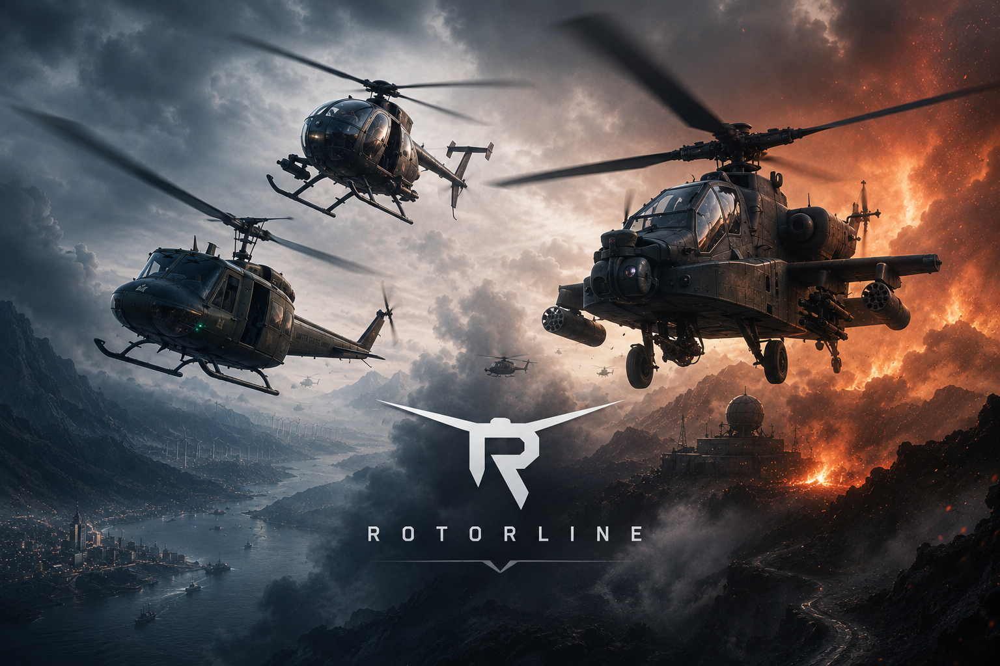

# Project Rotorline

> **ALPHA SOFTWARE:** Project Rotorline is actively being developed. Missions, balance, performance, controls, and presentation may change.

Project Rotorline is a helicopter-focused Unreal Engine 5.8 action game created by Keith League (Rooster). Its current Alpha campaign spans 25 missions across rescue, reconnaissance, escort, strike, extraction, heavy-lift, and final evacuation operations.

## Download and Play

[**Download ProjectRotorlineAlphaSetup.exe**](https://github.com/MilsimRooster/ProjectRotorline/releases/download/alpha-windows-v1/ProjectRotorlineAlphaSetup.exe)

Run the setup application and select **Install and Play**. It downloads the
complete current Alpha from the same `alpha-windows-v1` release, verifies every
payload hash, installs the required Microsoft runtimes, replaces an older
installation with rollback protection, creates the desktop shortcut, and
launches the game. Nothing points to an older Rotorline repository or release.

Windows may display a security warning because this Alpha installer is not
code-signed.

## Standalone Source Snapshot

This repository is a standalone Project Rotorline source snapshot. It is a
normal independent repository, not a fork, submodule, redirect, or pointer back
to an older Rotorline repository.

The current snapshot is synchronized from the verified canonical superior-MH-6
implementation checkpoint `7d6b053`.

Licensed binary assets are intentionally excluded, so a fresh clone is not a
build-complete Unreal project and is not presented as a playable distribution.

OH-58/Kiowa distribution permission is confirmed, and Keith League created and
owns the original Project Rotorline audio.

## Alpha Highlights

- 25-mission campaign with progression and aircraft unlocks
- Multiple flyable aircraft including the UH-1 Huey, high-detail MH-6 Little Bird, OH-58 Kiowa, AH-64 Apache, Bell 222, and CH-47 Chinook
- Model-native MH-6 main and tail rotor mounts, hubs, blades, and animation in the hangar and in flight
- Helicopter-focused flight, combat, countermeasures, resupply, extraction, convoy, and sling-load gameplay
- Handcrafted island, summit, hidden lair, enemy island, offshore carrier, airfields, towns, roads, and mission locations
- Controller-first input with in-game calibration and remapping
- Simple `Snail` and `Turbo` graphics presets for a wider range of Windows PCs
- Mission audio, radio callouts, music, cinematics, and progression systems

## Alpha Demo

[Download or watch Rotorline-Demo.mp4](https://github.com/MilsimRooster/ProjectRotorline/releases/download/alpha-demo-2026-07-29/Rotorline-Demo.mp4)

## Technology

- Unreal Engine 5.8
- C++ and Unreal project configuration
- Windows 64-bit target
- Current campaign data under `Content/Data`

## Current Status

Project Rotorline remains in Alpha. The current development campaign reaches
Mission 25. The current public Windows package is the verified
`alpha-windows-v1` release described above. Testing, optimization, content
polish, accessibility, and hardware coverage are ongoing.

Performance targets and minimum requirements are provisional. Testing has included an RTX 2060-class system at approximately 30 FPS under reduced settings, but results vary by mission, resolution, and hardware.

## Controls

Project Rotorline supports keyboard, gamepad, and flight-control hardware. Use the in-game Flight Controls menu for device selection, axis calibration, and bindings; exact mappings may differ between devices and player profiles.

## Campaign

See [docs/MISSIONS.md](docs/MISSIONS.md) for the current 25-mission catalog.

## Credits and Rights

See [CREDITS.md](CREDITS.md) for project and third-party attribution.

Original Project Rotorline code, writing, mission design, branding, and media are copyright Keith League. All rights reserved. Third-party assets remain subject to their respective creators and licenses.

## Contact

Project updates and public demonstrations are published by MilsimRooster.
